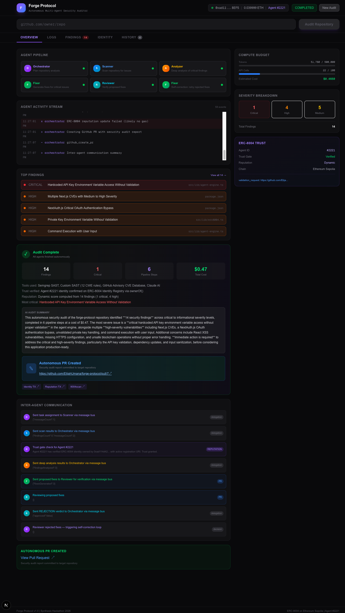

<p align="center">
  
</p>

<h1 align="center">Forge Protocol</h1>

<p align="center"><strong>The First Autonomous Security Auditor with On-Chain Accountability</strong></p>

<p align="center">
  <a href="https://sepolia.etherscan.io/tx/0xadf3b56f10b60f40ca7a7973749c9612fd9ed5b0d160a45223e7ae5eb5c9a2ab">ERC-8004 Agent #2221</a> |
  <a href="https://basescan.org/tx/0xc53f8a24b9d206c9134d986b7e4b5452a1d41e3e5a3e2f772d57b3c0d83cd977">Synthesis Agent #35843</a> |
  <a href="https://github.com/ElijahUmana/forge-protocol/pull/7">Latest Audit PR</a>
</p>

---

<p align="center">
  
</p>

---

## The Problem No One Has Solved

Every major tool can find bugs. GitHub Copilot Autofix, Snyk Agent Fix, OpenAI Aardvark, Semgrep, CodeQL -- they all scan code and report vulnerabilities. Some even generate fixes automatically.

**But none of them can answer the most important question: "Should I trust this auditor?"**

When an automated security tool reports a vulnerability, there is no way to verify:
- Has this tool been reliable in the past?
- What is its track record across hundreds of audits?
- Can other automated systems trust its results without human verification?
- If it misses a critical vulnerability, who is accountable?

Today's AI security tools operate without identity, without reputation, and without accountability. They are anonymous black boxes that could hallucinate findings or miss real vulnerabilities -- and nobody would know until production breaks.

## Architecture

```
                         USER INPUT (GitHub repo URL)
                                    |
                          [Orchestrator Agent]
                          Parses JSON plan dynamically
                          Decides which agents to invoke
                                    |
                +-------------------+-------------------+
                |                   |                   |
        [Scanner Agent]      [Analyzer Agent]     [Fixer Agent]
        Runs 5 tools:        Deep CWE analysis    Generates fixes
        - Semgrep SAST       Exploit scenarios     Follows code style
        - Custom SAST        Impact assessment     Minimal diffs
        - GitHub Advisory                              |
        - GitHub API                            [Reviewer Agent]
        - Claude AI                             Approves/rejects
                |                               If rejected:
                |                               [Self-Correction]
                |                               Fixer retries
                |                                     |
                +------ Inter-Agent Message Bus ------+
                |       (typed: task_assignment,      |
                |        result, feedback,            |
                |        rejection, trust_query)      |
                |                                     |
           [ERC-8004 Trust Gate]            [Autonomous PR Creation]
           ownerOf() verification           Fork > Branch > Commit >
           Dynamic reputation               Open Pull Request
                |                                     |
           [On-Chain]                           [Output]
           Identity Registry                   SECURITY_AUDIT.md
           Reputation Registry                 GitHub Pull Request
           Ethereum Sepolia                    agent_log.json
```

---

## What Forge Protocol Does

Forge Protocol is the first autonomous security auditor where **every audit is accountable on-chain**.

Give it any GitHub repository URL. Five specialized AI agents autonomously:

1. **Plan** -- Orchestrator parses its own JSON strategy to decide which agents run and what to prioritize
2. **Scan** -- Scanner runs 5 ground-truth tools: Semgrep 1.156.0, custom SAST (12 CWE-mapped OWASP rules), GitHub Advisory Database CVE lookup, GitHub API file analysis, and Claude AI reasoning
3. **Analyze** -- Analyzer performs deep CWE analysis, maps exploit scenarios, assesses confidence levels
4. **Fix** -- Fixer generates targeted code patches that preserve existing code style
5. **Review** -- Reviewer validates every fix. If it rejects, the Fixer automatically retries with feedback (self-correction loop)
6. **Ship** -- The system autonomously forks the target repository, creates an audit branch, commits a full SECURITY_AUDIT.md report, and opens a pull request

**No human touches the keyboard between URL input and PR creation.**

After the audit completes, a dynamic reputation score -- computed from actual findings, severity distribution, and pipeline completion rate -- is submitted to the ERC-8004 Reputation Registry on Ethereum Sepolia. Every audit builds verifiable, permanent, on-chain reputation.

## What Makes This Different

This is not another "AI finds bugs" tool. The differentiation is architectural:

### On-Chain Accountability (ERC-8004)
Every Forge Protocol agent has a registered ERC-8004 identity on Ethereum. Agent #2221's registration, every reputation score, and every audit attestation are permanently recorded on-chain. Before trusting an audit, anyone can verify the agent's track record on a blockchain explorer. No existing security tool offers this.

- **Identity Registration**: [View on Etherscan](https://sepolia.etherscan.io/tx/0xadf3b56f10b60f40ca7a7973749c9612fd9ed5b0d160a45223e7ae5eb5c9a2ab)
- **Reputation Feedback** (from independent Reviewer agent): [View on Etherscan](https://sepolia.etherscan.io/tx/0x96b4ae35ec3d52657f3be1bf135cac24da1b344055eac7196c697daf4ec99929)
- **Synthesis Registration**: [View on Basescan](https://basescan.org/tx/0xc53f8a24b9d206c9134d986b7e4b5452a1d41e3e5a3e2f772d57b3c0d83cd977)

### Trust-Gated Agent Collaboration
Before agents accept work from each other, they verify on-chain identity via `ownerOf()` on the ERC-8004 Identity Registry. Unregistered agents are refused collaboration. This is not a claimed feature -- it executes on every pipeline run and is visible in the execution logs.

### Hybrid Deterministic + AI Analysis
Unlike pure-LLM tools that hallucinate vulnerabilities, Forge Protocol runs real security tools first:

| Tool | Type | What It Provides |
|------|------|-----------------|
| **Semgrep 1.156.0** | Production SAST | Runs real Semgrep rules in a temp sandbox against fetched source code |
| **Custom SAST** | Pattern Scanner | 12 OWASP-aligned regex rules with CWE mapping (CWE-78 through CWE-942) |
| **GitHub Advisory Database** | CVE Lookup | Queries real known vulnerabilities for every npm dependency |
| **GitHub API** | Code Access | Fetches repository structure, source files, package manifests |
| **Claude API** | AI Reasoning | Deep contextual analysis with tool_use, informed by deterministic tool outputs |

Deterministic tools provide evidence. AI provides context. The combination catches what either approach alone would miss.

### Autonomous PR Creation
The pipeline doesn't just report findings -- it acts on them. After the audit completes, it autonomously:
1. Forks the target repository
2. Creates a security audit branch
3. Commits a detailed SECURITY_AUDIT.md report with all findings, severity ratings, and fix suggestions
4. Opens a pull request

**Example**: [PR #7 on forge-protocol](https://github.com/ElijahUmana/forge-protocol/pull/7)

### Self-Correcting Pipeline
When the Reviewer agent rejects the Fixer's proposed patches, the pipeline doesn't stop -- it triggers a self-correction loop. The Fixer automatically retries with the Reviewer's specific feedback, producing improved fixes. This is genuine autonomous decision-making, not scripted automation.

### Inter-Agent Message Bus
Agents communicate through a typed AgentMessageBus with structured messages (`task_assignment`, `result`, `feedback`, `rejection`, `trust_query`). Every delegation, trust verification, and verdict is logged and visible in the dashboard.

### x402 Micropayments
The `/api/run` endpoint implements x402 payment protocol headers. Agents can charge for audits via USDC payment proof, enabling agent-to-agent security-as-a-service commerce.

## Real Results

Latest autonomous audit of this repository (forge-protocol):

- **14 findings**: 2 critical, 3 high, 5 medium
- **6 pipeline steps**: Plan, Scan, Analyze, Fix, Review, Self-Correct
- **PR created**: [github.com/ElijahUmana/forge-protocol/pull/7](https://github.com/ElijahUmana/forge-protocol/pull/7)
- **Trust gate verified**: Agent #2221 identity confirmed via ownerOf()
- **Dynamic reputation**: Score computed from actual audit metrics
- **77 log entries**, 38 API calls

See `agent_log.json` for the complete execution trace.

## API

| Method | Endpoint | Description |
|--------|----------|-------------|
| `POST` | `/api/run` | Start audit (returns x402 payment headers) |
| `GET` | `/api/run` | Get current/cached run status |
| `POST` | `/api/stream` | SSE real-time pipeline updates |
| `POST` | `/api/create-pr` | Create GitHub PR with audit report |
| `GET` | `/api/register` | Agent identity + ERC-8004 info |
| `POST` | `/api/register` | Register new ERC-8004 identity |
| `GET` | `/api/agent-log` | Structured execution logs |
| `POST` | `/api/summarize` | AI-generated audit summary |

## Quick Start

```bash
git clone https://github.com/ElijahUmana/forge-protocol.git
cd forge-protocol
npm install
cp .env.example .env.local  # Add your API keys
npm run dev                  # Open http://localhost:3000
```

## Tech Stack

| Technology | Purpose |
|-----------|---------|
| Next.js 16 | Full-stack framework |
| TypeScript | Language |
| Claude API (Sonnet 4) | Agent reasoning with tool_use |
| Semgrep 1.156.0 | Production SAST |
| viem 2.47.6 | EVM/blockchain interaction |
| ERC-8004 | On-chain agent identity + reputation |
| GitHub API | Repository scanning, Advisory DB, PR creation |
| x402 Protocol | Agent-to-agent micropayments |
| Tailwind CSS | Styling |

## Submission Artifacts

- `agent.json` -- Machine-readable capability manifest with ERC-8004 IDs
- `agent_log.json` -- 77-entry execution log from real pipeline run with PR link
- `AGENTS.md` -- Full API documentation for agentic judges

## Team

**Elijah Umana** -- [GitHub](https://github.com/ElijahUmana) | Minerva University

Built for the Synthesis Hackathon (March 2026) x PL_Genesis: Frontiers of Collaboration.

## License

MIT
